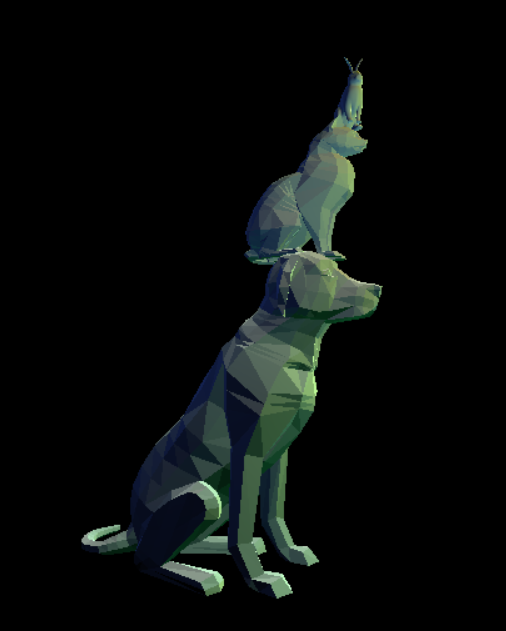
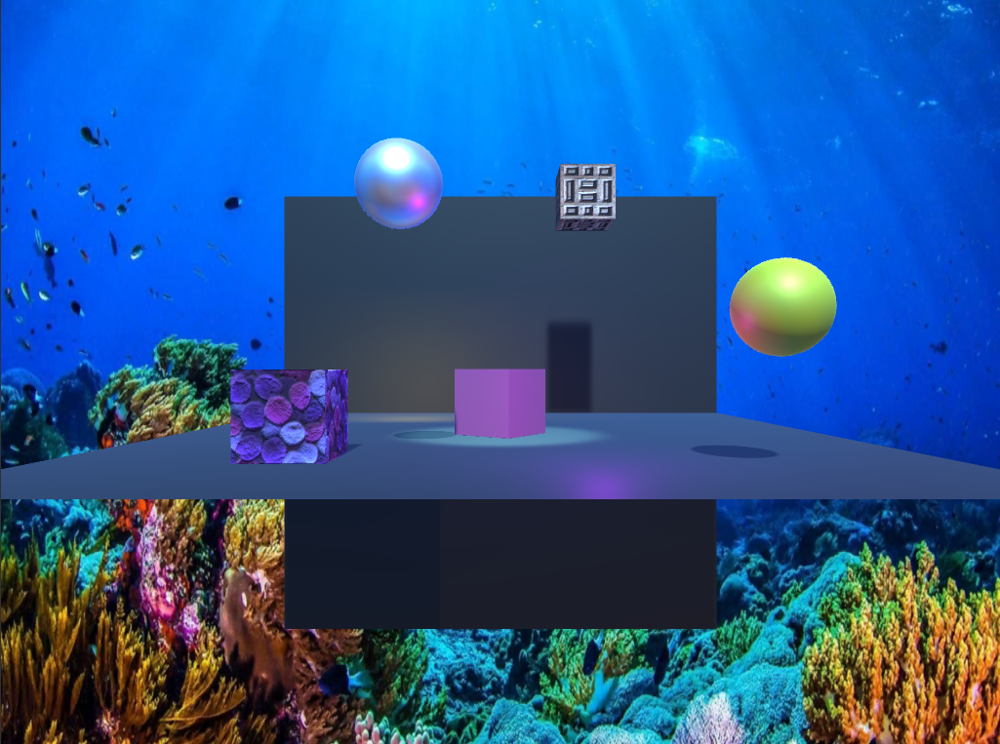
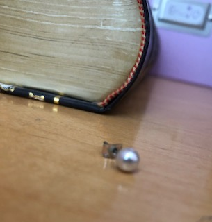
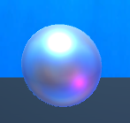

# CMPM163Labs
## lab 2
video: [lab2](https://drive.google.com/file/d/1v80JFHKpnjn0SIYwIFtktsyKr1GgK6_p/view?usp=sharing)

## lab 3
video: [lab3](https://drive.google.com/file/d/1xnUWgztpeoFR3ib15U4wUwX_iNl-c0vL/view?usp=sharing)

-The first cube on the left is cube with a green specular highlight made with three.js phong material

-The second cube from the left is a transparent cube with yellow emisssion made with three.js lambert material

-The third cube from the left is a cube with color interpolation made with my own shaders, using colors peach and hot pink

-The fourth cube is a rainbow cube made with my own shaders, using the color white as a base

## lab4
video: [lab4](https://drive.google.com/file/d/17oYznkBdISTJ3uzKYn7pYYPeJOj0x5Lv/view?usp=sharing)

-1st cube from the left is cube made with only a wooden texture using three.js

-2nd cube from the left is cube made with a wooden texture and a matching normal map using three.js

-3rd cube is a cube with a pinkish texture and a brick-square normal map using three.js

-4th cube is a cube with a mossy texture made with own shaders.

-5th cube is a cube with a 2x2 tiled wooden texture made with own shaders. I was able to create the tiling effect by first
taking a look in the fragment shader at the x and y values of vUv, which was passed in from the vertex shader. If the values 
were over 0.5, the texture pattern would repeat from earlier coordinates. Then, I scaled the texture down by dividing 
vUv by 0.5, to create the 2x2 tiles.    

Question 24:

a. x = u * 8 

b. y = v * 8 

c. (x, y) = (0.375 * 8, 0.25 * 8) = (3, 2), therefore the color is white

## lab5
video: [lab5](https://drive.google.com/file/d/1DkxfmCL6Vi5QLyd6G9j2HLYHizpV1UpQ/view?usp=sharing)

I chose to do Part 1 for this lab. Note: the scene I worked in is myscene.unity

For this lab, I created particles of varying sizes that change from yellow to pink to blue. I changed the skybox to be a galaxy sky, and made the sun pink to better complement the colors of the skybox. I added models for buildings, a rocket, crystals, and gummy bears. I also added preset props such as a ramp and bowling pins, and changed the driving track. I edited the materials for the player, cart, hills, and crystals.

## lab6
### i.  
screenshot: 

### ii.  
point light- behaves like a bare lightbulb. How it illuminates objects in the scene depends on the light's position. This light shines in every direction, so the rotation of the light doesn't matter.

spotlight- behaves like a flashlight. It shines light in a certain direction, and it illuminates all objects within a cone. Both the position and rotation matter.

directional light- behaves like the sun. It shines light in a certain direction, and it affects all the objects in the scene. The position of the light does not matter.

area light- only works when baking a light map. It shines in all directions to one side of a rectangular plane.

### iii.  
Real life pearl earring vs my pearl made in unity:  
 

### iv.  
For the pearl, I used the standard specular material so that it would be very shiny. I set both the albedo and the specular color to white. I also set the smoothness to about 0.5 to mimic the look of a pearl in real life.

### v.  
For one texture, I used purple puffballs. For another texture, I used a wooden block pattern.

### vi.  
I added an ocean skybox.
