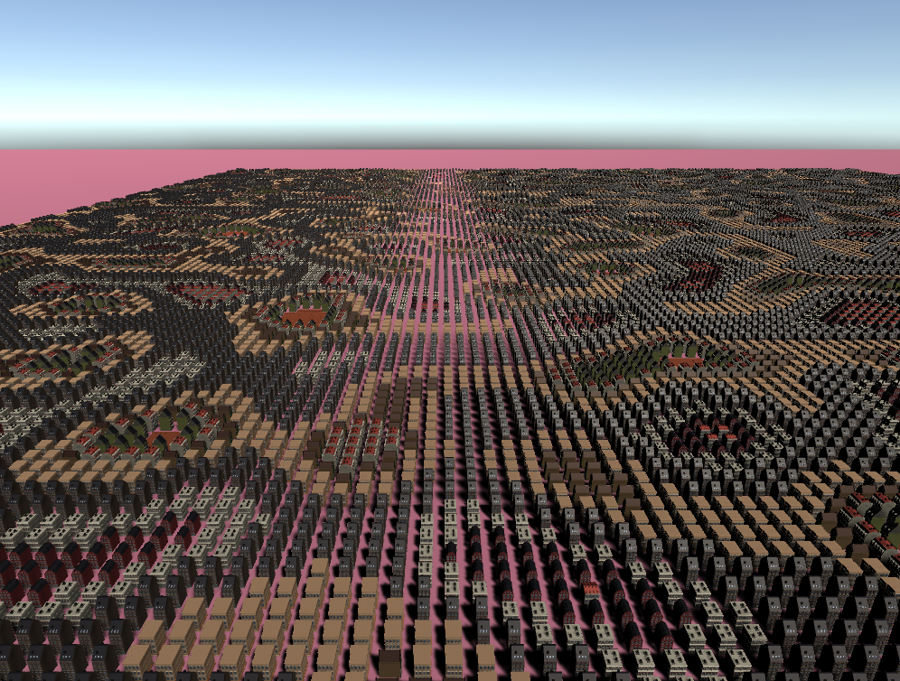
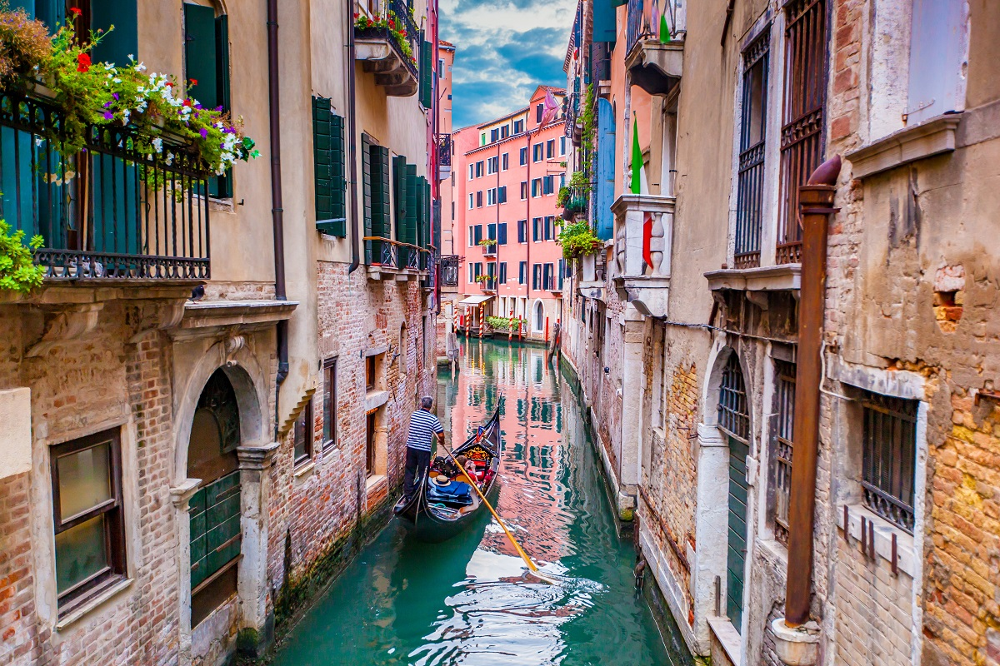
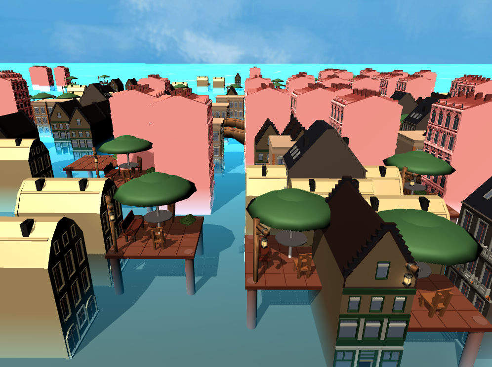

# CMPM163Labs
## lab 2
video: [lab2](https://drive.google.com/file/d/1v80JFHKpnjn0SIYwIFtktsyKr1GgK6_p/view?usp=sharing)

## lab 3
video: [lab3](https://drive.google.com/file/d/1xnUWgztpeoFR3ib15U4wUwX_iNl-c0vL/view?usp=sharing)

-The first cube on the left is cube with a green specular highlight made with three.js phong material

-The second cube from the left is a transparent cube with yellow emisssion made with three.js lambert material

-The third cube from the left is a cube with color interpolation made with my own shaders, using colors peach and hot pink

-The fourth cube is a rainbow cube made with my own shaders, using the color white as a base

## lab4
video: [lab4](https://drive.google.com/file/d/17oYznkBdISTJ3uzKYn7pYYPeJOj0x5Lv/view?usp=sharing)

-1st cube from the left is cube made with only a wooden texture using three.js

-2nd cube from the left is cube made with a wooden texture and a matching normal map using three.js

-3rd cube is a cube with a pinkish texture and a brick-square normal map using three.js

-4th cube is a cube with a mossy texture made with own shaders.

-5th cube is a cube with a 2x2 tiled wooden texture made with own shaders. I was able to create the tiling effect by first
taking a look in the fragment shader at the x and y values of vUv, which was passed in from the vertex shader. If the values 
were over 0.5, the texture pattern would repeat from earlier coordinates. Then, I scaled the texture down by dividing 
vUv by 0.5, to create the 2x2 tiles.    

Question 24:

a. x = u * 8 

b. y = v * 8 

c. (x, y) = (0.375 * 8, 0.25 * 8) = (3, 2), therefore the color is white

## lab5
video: [lab5](https://drive.google.com/file/d/1DkxfmCL6Vi5QLyd6G9j2HLYHizpV1UpQ/view?usp=sharing)

I chose to do Part 1 for this lab. Note: the scene I worked in is myscene.unity

For this lab, I created particles of varying sizes that change from yellow to pink to blue. I changed the skybox to be a galaxy sky, and made the sun pink to better complement the colors of the skybox. I added models for buildings, a rocket, crystals, and gummy bears. I also added preset props such as a ramp and bowling pins, and changed the driving track. I edited the materials for the player, cart, hills, and crystals.

## lab6
### i.  
screenshot: 

### ii.  
point light- behaves like a bare lightbulb. How it illuminates objects in the scene depends on the light's position. This light shines in every direction, so the rotation of the light doesn't matter.

spotlight- behaves like a flashlight. It shines light in a certain direction, and it illuminates all objects within a cone. Both the position and rotation matter.

directional light- behaves like the sun. It shines light in a certain direction, and it affects all the objects in the scene. The position of the light does not matter.

area light- only works when baking a light map. It shines in all directions to one side of a rectangular plane.

### iii.  
Real life pearl earring vs my pearl made in unity:  
 

### iv.  
For the pearl, I used the standard specular material so that it would be very shiny. I set both the albedo and the specular color to white. I also set the smoothness to about 0.5 to mimic the look of a pearl in real life.

### v.  
For one texture, I used purple puffballs. For another texture, I used a wooden block pattern.

### vi.  
I added an ocean skybox.

## lab 7
video: [lab7](https://drive.google.com/file/d/1_-_KQftdrlNwHEdYvgvU-EvNTXhDdHB_/view?usp=sharing)

In this scene, I created an island with mountains and a rocky shore. Both of these were made with planes using a modified version of the noise disorted mesh from the tutorial. The tutorial on the wave shader was used to created the surrounding ocean, which has waves that lap over the shore. There are clouds in the sky created with the noise disorted mesh from the tutorial. The skybox is a dark blue night sky, with a blue directional light to match the scene. Bubbles rising from the ocean were created using my own material. The material made use of a map that would add a rainbow swirl effect in order to mimic the look of a real bubble. A light post from Unity's presets was added to the rocky shore and shone a yellow spotlight on some of the bubbles in order to highlight them. 

Partner's response:  
i) part 2  
ii) challenging part was understanding how to manipulate code in order to change positions and scale model the way I want and  implementing shader  
iii) it was interesting to see that you could create a wave just by manipulating plane

## lab 8
Generated city based on tutorial: 
Real city inspiration (Venice): 
My generated city based on inspiration: 

Explanation: Water was added to the scene to make the city look like Venice. The spacing between buildings is randomized so that some buildings would be right next to each other while other buildings would be far apart to make room for canals. Some models were grouped together in ways that made sense. For instance, a patio with a table, umbrella, and chairs all appear together as one object. Bridges were also placed above water level randomly.

### partner check-in  
To create this city, my partner generated 5 objects using the Three.js library. A dark colored plane for the street surface, a colored cube to populate the street plane with nested looping and randomized heights, a plane with a sand texture applied, a plane using a customized shader to simulate moving waves, and a “skybox” cube with seamless textures applied along all faces with the camera placed inside to simulate a starry night sky. What I found interesting about my partner's city was that it looked like a beachside city. During the lab, we did not help each other.
